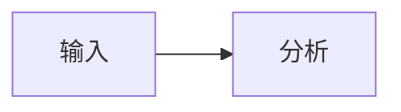

# slidev-theme-hebmu

A [Slidev](https://sli.dev) presentation theme for **河北医科大学 (Hebei Medical University)** academic teaching — Chinese-first typography with bilingual (中/EN) support.

## Features

- Chinese-first typography (PingFang SC, CJK-optimized spacing)
- Bilingual layout support (Chinese title + English subtitle)
- Session-based structure (学时): 40min + 10min break + 40min
- Light-first classroom presentation design
- Bioinformatics-optimized: Mermaid diagram theming, code highlighting
- Compact density option for table/code-heavy teaching slides
- 13 layouts, 8 components

## Quick Start

### In your Slidev project

Add the theme as a local dependency in your `package.json`:

```json
{
  "dependencies": {
    "slidev-theme-hebmu": "file:path/to/slidev-theme-hebmu"
  }
}
```

Then set it in your slide frontmatter:

```markdown
---
theme: hebmu
fonts:
  sans: 'PingFang SC'
  mono: 'Fira Code'
htmlAttrs:
  lang: zh-CN
---
```

## Layouts

| Layout | Description | Key Props |
|---|---|---|
| `cover` | Title slide with university branding | `coverAuthor`, `coverDate`, `courseName`, `sessionNumber` |
| `section` | Section divider (第X节) | `sectionNumber`, `sectionTitle`, `sectionTitleEn` |
| `default` | Standard content slide | — |
| `center` | Vertically centered emphasis | — |
| `intro` | Course/session overview | `courseTitle`, `sessionNumber` |
| `two-col` | Two-column comparison | — |
| `figure` | Full-slide figure with caption | `figureUrl`, `figureCaption` |
| `figure-footnote` | Full-slide figure with reserved citation area | `figureUrl`, `figureCaption`, `figureFootnoteNumber` |
| `figure-side` | Content + figure side-by-side | `figureUrl`, `figureX` |
| `table-of-contents` | Keynote-style agenda/content slide | `contentItems`, `active`, `contentImageUrl` |
| `break` | Break divider (10 min) | `breakMinutes` |
| `end` | Thank you / Q&A | `endMessage`, `endMessageEn` |
| `quote` | Key definition blockquote | `quoteSource`, `quoteAuthor` |

## Components

| Component | Description |
|---|---|
| `<Pagination>` | Current slide number |
| `<Footnotes>` / `<Footnote>` | Reference footnotes |
| `<BilingualTitle>` | Chinese + English title pair |
| `<SessionInfo>` | 学时 session progress |
| `<FigureWithOptionalCaption>` | Reusable figure rendering |
| `<SlideTitle>` | Internal shared slide title renderer |
| `<KeynoteChrome>` / `<KeynoteShell>` | Internal theme chrome and layout shell |

## ThemeConfig

Set in the first slide's frontmatter:

```yaml
themeConfig:
  paginationX: 'r'     # 'l' or 'r'
  paginationY: 'b'     # 't' or 'b'
  paginationPagesDisabled: [1]  # Pages without pagination
  footerMode: 'compact'          # 'compact', 'full', or 'none'
  contentItems:                 # optional default items for table-of-contents
    - 生物信息学及工具
    - 药物发现：从0到1的数字旅程
    - CADD实战：从靶点到候选药物
```

Use compact density on content-heavy slides:

```markdown
---
layout: default
density: compact
---
```

Standard framed layouts (`default`, `intro`, `two-col`, `figure`,
`figure-side`, and `figure-footnote`) use a shared `SlideTitle`. Existing
slides can keep `# Slide Title`; the first H1 is promoted into the chrome title.
For new slides that need in-frame section headings, use `slideTitle` in
frontmatter and keep H1 for smaller content headers:

```markdown
---
layout: default
slideTitle: PPI 分析流程
---

# 输入数据

- 表达矩阵
- 候选基因列表
```

Use `figure-footnote` when a full-slide figure also needs a citation block.
The layout reserves vertical space for `<Footnotes>` so citations do not overlap
the image caption or footer:

```markdown
---
layout: figure-footnote
figureUrl: /campus-end.jpeg
figureCaption: '全页图片布局示例'
figureFootnoteNumber: 1
---

# 图片及脚注示例

<Footnotes :separator="true" x="l" y="col">
  <Footnote :number="1">Author A, et al. Journal. Year.</Footnote>
</Footnotes>
```

Mermaid diagrams use the theme's `setup/mermaid.ts` defaults. For dense
diagrams, prefer Slidev's built-in scale option on the code fence:

````markdown

````

`footerMode: compact` shows department + page number on regular slides. Use
`footerMode: full` to keep author, email, and WeChat on every slide, or
`footerMode: none` to hide the global footer. Closing contact details remain
available on the `end` layout.

Use the Keynote-style content slide with per-slide frontmatter:

```markdown
---
layout: table-of-contents
active: 2
contentItems:
  - 生物信息学及工具
  - 药物发现：从0到1的数字旅程
  - CADD实战：从靶点到候选药物
---
```

## Development

```bash
bun install
bun run dev      # Preview with example.md
bun run build    # Build static site
bun run export   # Export to PDF
bun run screenshot  # Export PNG slides for visual checks
```

## License

MIT
