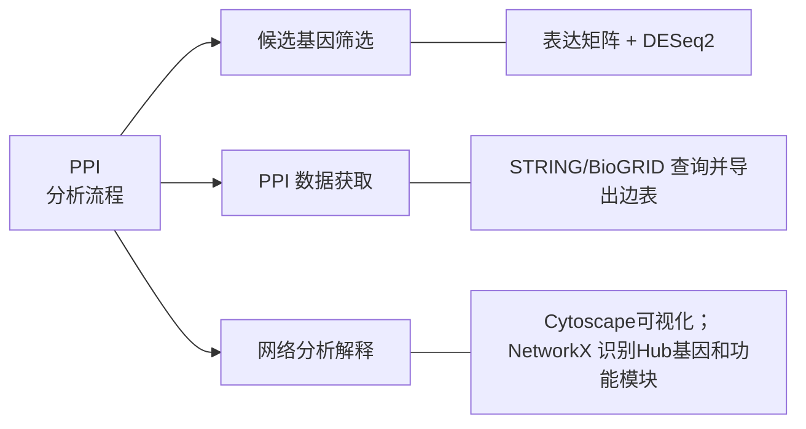

# 生物信息学数据库： 入门教程
## 理解现代医学中的数字基建

---
layout: intro
---

# 本节内容概览

1. 蛋白质相互作用网络基础
2. PPI 数据库与数据准备
3. 网络构建与可视化
4. 网络拓扑分析与实操

---
layout: table-of-contents
active: 1
contentItems:
  - 蛋白质相互作用网络基础
  - PPI 数据库与数据准备
  - 网络构建与可视化
  - 网络拓扑分析与实操
---

---
layout: table-of-contents
active: 4
contentItems:
  - 蛋白质相互作用网络基础
  - PPI 数据库与数据准备
  - 网络构建与可视化
  - 网络拓扑分析与实操
  - 长标题和紧凑排版验证
---

---
layout: default
density: compact
---

# 长标题换行与紧凑页脚示例：从数据库证据整合到蛋白质相互作用网络解释

这页用于验证标题自动换行、正文深色可读性和普通页脚的紧凑显示。主题仍保留河北医科大学紫色识别，但正文内容不再全部使用紫色。

- 长标题应该自然换行，不截断核心信息
- 普通内容页默认只显示部门和页码
- 紧凑密度适合表格、代码和步骤说明

---
layout: section
sectionNumber: 1
sectionTitle: 蛋白质相互作用网络基础
sectionTitleEn: PPI Network Basics
---

---
layout: default
---

# 为什么研究 PPI 网络

- 蛋白质通常通过相互作用共同完成细胞功能
- PPI 网络把蛋白质表示为节点，把相互作用表示为边
- 网络视角有助于发现 hub 蛋白、功能模块和潜在药物靶点

> 无标度网络 (Scale-free Network) 是许多生物分子网络的典型特征。

---
layout: center
---

# 核心观点

**从“单个基因/蛋白”转向“相互作用网络”，可以更接近细胞系统层面的功能解释。**

---
layout: two-col
---

# PPI 网络中的两类关系

::left::

**物理相互作用**

- 蛋白质复合物
- 直接结合证据
- 适合解释分子机制

::right::

**功能关联**

- 共表达或共同通路
- 文献和数据库证据
- 适合发现功能模块

---
layout: quote
quoteAuthor: 'Barabási & Albert'
quoteSource: 'Science, 1999'
---

> **无标度网络 (Scale-free Network)**: 网络中节点的度分布服从幂律分布 P(k) ~ k^(-γ)，少数枢纽节点 (hub) 拥有大量连接。

---
layout: section
sectionNumber: 2
sectionTitle: PPI 数据库与数据准备
sectionTitleEn: Data Sources and Preparation
---

---
layout: default
density: compact
---

# 常用 PPI 与通路数据库

| 数据库 Database | 类型 Type | 物种 Species | URL |
|---|---|---|---|
| STRING | PPI | 多物种 | https://string-db.org |
| BioGRID | PPI | 多物种 | https://thebiogrid.org |
| KEGG | 代谢通路 | 多物种 | https://kegg.jp |
| Reactome | 信号通路 | 多物种 | https://reactome.org |

---
layout: figure-side
title: STRING 数据库
slideTitle: STRING 数据库
figureUrl: /hebmu-logo.png
figureCaption: '数据库界面或检索结果截图可放在此处'
figureX: r
---
# 数据库特点

- 已知和预测的 PPI
- 多种证据来源
  - 实验验证
  - 数据库注释
  - 文本挖掘
- 输出可供 Cytoscape 或 NetworkX 使用的边表

---
layout: default
density: compact
---

# 从表达矩阵筛选候选基因

差异表达分析通常在网络构建之前完成，用于缩小后续 PPI 查询范围。

```r
library(DESeq2)

dds <- DESeqDataSetFromMatrix(
  countData = count_data,
  colData = sample_info,
  design = ~ condition
)
dds <- DESeq(dds)
res <- results(dds, alpha = 0.05)

res_df <- as.data.frame(res)
candidate_genes <- subset(
  res_df,
  !is.na(padj) & padj < 0.05 & abs(log2FoldChange) >= 1
)
```

---
layout: break
breakMinutes: 10
---

---
layout: section
sectionNumber: 3
sectionTitle: 网络构建与可视化
sectionTitleEn: Network Construction and Visualization
---

---
layout: default
---

# PPI 分析流程



---
layout: figure
figureUrl: /campus-end.jpeg
figureCaption: '全页图片布局示例：可替换为 Cytoscape 网络图'
---
# Cytoscape 实操步骤
---
layout: default
---

# Cytoscape 实操步骤

1. 从 STRING 或 BioGRID 导出 interaction table
2. 在 Cytoscape 中导入网络和节点属性表
3. 使用 degree、betweenness 等指标映射节点大小和颜色
4. 导出网络图，用于报告或后续解释

---
layout: section
sectionNumber: 4
sectionTitle: 网络拓扑分析方法
sectionTitleEn: Network Topology Analysis
---

---
layout: default
density: compact
---

# 使用 NetworkX 计算拓扑指标

```python
import networkx as nx

G = nx.read_edgelist("ppi_edges.tsv", delimiter="\t")

degree = dict(G.degree())
betweenness = nx.betweenness_centrality(G)
avg_clustering = nx.average_clustering(G)

hub_genes = sorted(degree, key=degree.get, reverse=True)[:10]
bridge_genes = sorted(betweenness, key=betweenness.get, reverse=True)[:10]

print(f"节点数: {G.number_of_nodes()}")
print(f"边数: {G.number_of_edges()}")
print(f"平均聚类系数: {avg_clustering:.2f}")
print("Top hub genes:", hub_genes)
print("Top bridge genes:", bridge_genes)
```

---
layout: default
---

# 脚注示例 Footnotes (文本文字)

蛋白质相互作用网络是理解细胞功能的重要工具。

<Footnotes :separator="true">
  <Footnote :number="1">Barabási AL, et al. Network biology: understanding the cell's functional organization. Nat Rev Genet. 2004.</Footnote>
  <Footnote :number="2">Szklarczyk D, et al. STRING v11: protein-protein interaction networks. Nucleic Acids Res. 2019.</Footnote>
</Footnotes>

---
layout: figure-footnote
figureUrl: /campus-end.jpeg
figureCaption: '全页图片布局示例：可替换为 Cytoscape 网络图'
figureFootnoteNumber: 1
---

# 图片及脚注示例

<Footnotes :separator="true" x="l" y="col">
  <Footnote :number="1">Barabási AL, et al. Network biology: understanding the cell's functional organization. Nat Rev Genet. 2004.</Footnote>
</Footnotes>

---
layout: end
endMessage: '谢谢！'
endMessageEn: 'Thank You!'
---
